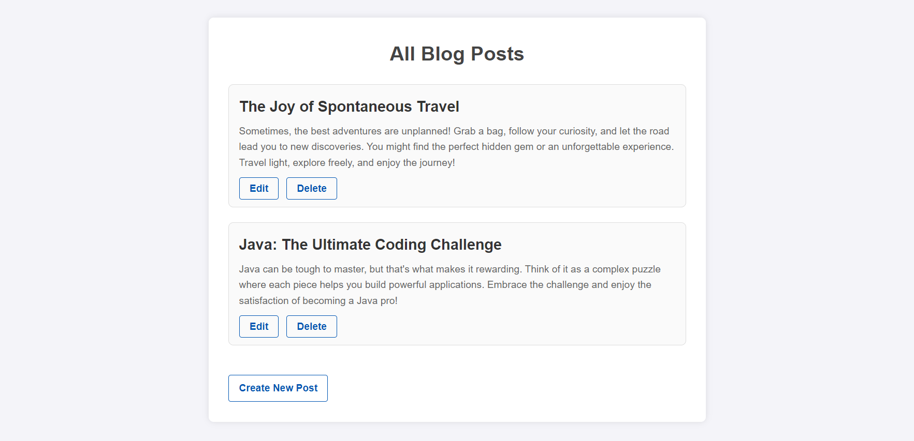

# MyBlog Application
MyBlog is a simple blogging application built with Spring Boot. It allows users to create, update, view, and delete blog posts. The application uses Thymeleaf for rendering views, and JPA (Java Persistence API) for interacting with a database.

## Features

- **View All Posts**: See a list of all blog posts.
- **Create New Post**: Create and add a new blog post.
- **Edit Post**: Update the content of an existing blog post.
- **Delete Post**: Remove a blog post from the list.

## Project Structure

- **Controller**: Handles HTTP requests and returns appropriate views.
- **Model**: Represents the Post entity with attributes like `title` and `content`.
- **Service**: Contains business logic and interacts with the repository to perform CRUD operations.
- **Repository**: Provides an abstraction for the database operations using Spring Data JPA.
- **View**: Thymeleaf templates for displaying content to the user.

## Technologies Used

- **Spring Boot**: For building the application and managing dependencies.
- **Thymeleaf**: As a template engine for rendering HTML pages.
- **JPA & Hibernate**: For ORM and database interactions.
- **MySQL**: For persistent data storage in a relational database.

## Screenshots

### View All Posts

### Create New Post

